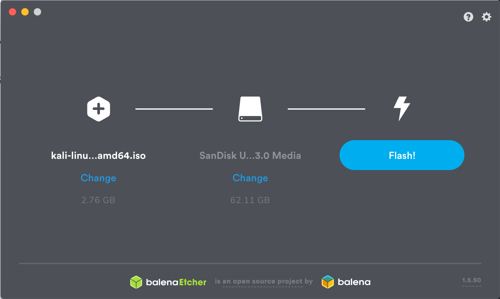

# Bootable USB with Kali 2020

## What You'll Need

1. A verified copy of the appropriate ISO image of the latest Kali build image for the system you’ll be running it on: see the details on [downloading official Kali Linux images](https://www.kali.org/docs/introduction/download-official-kali-linux-images/).   [Downloads](https://www.kali.org/downloads/)
2. If you’re running under Windows, you’ll also need to download the [Etcher](https://www.balena.io/etcher/) imaging tool. On Linux and OS X, you can use the dd  command, which is pre-installed on those platforms, or use [Etcher](https://www.balena.io/etcher/).
3. A USB thumb drive, 4GB or larger. (Systems with a direct SD card slot can use an SD card with similar capacity. The procedure is identical.)

## Kali Linux Live USB Install Procedure

#### The specifics of this procedure will vary depending on whether you’re doing it on a Windows, Linux, or OS X system.

### Creating a Bootable Kali USB Drive on Windows

1. Plug your USB drive into an available USB port on your Windows PC, note which drive designator (e.g. “F:\“) it uses once it mounts, and launch Etcher.
2. Choose the Kali Linux ISO file to be imaged with “select image” and verify that the USB drive to be overwritten is the correct one. Click the “Flash!” button once ready.  
3. Once Etcher alerts you that the image has been flashed, you can safely remove the USB drive and proceed to boot into Kali with it.

 
 

For more information, check the [source page](https://www.kali.org/docs/usb/kali-linux-live-usb-install/)
 
*Last checked: 16/04/2020*